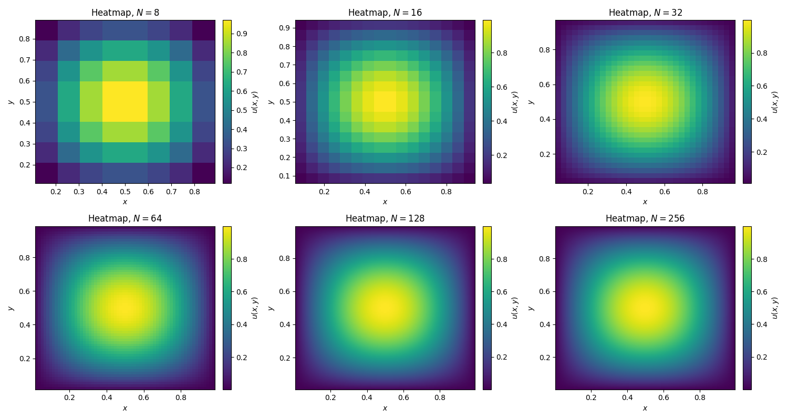

# Case Studies in High-Performance Computing <!-- omit from toc -->

## Assignment 3 - Conjugate Gradient Solver <!-- omit from toc -->

- [Mathematical Background](#mathematical-background)
  - [The Poisson Problem](#the-poisson-problem)
    - [Discretisation Approach](#discretisation-approach)
      - [Grid](#grid)
      - [Finite Difference Approximation](#finite-difference-approximation)
      - [Ordering of the Grid Points](#ordering-of-the-grid-points)
- [Serial Implementation of the Conjugate Gradient Algorithm](#serial-implementation-of-the-conjugate-gradient-algorithm)
  - [Mathematical Explanation for Convergence in One Iteration](#mathematical-explanation-for-convergence-in-one-iteration)
  - [Updated Solution](#updated-solution)
  - [Graphs](#graphs)
  - [Discussion of Findings](#discussion-of-findings)

### Mathematical Background

As per the assignment instructions, we are tasked with implementing a Poisson problem on a unit square and then solving it using the conjugate gradient (CG) method.

#### The Poisson Problem

We are given the Poisson problem on the unit square $\Omega=(0,1)^2$:

```math
\begin{cases}-\Delta(x)=f(x)&\text{on the interior of }\Omega,\\u(x)=0&\text{on the boundary of }\partial\Omega,\end{cases}
```

where $\Delta u(x)=\frac{\partial^2u}{\partial x_1^2}+\frac{\partial^2u}{\partial x_2^2}$ is the Laplacian operator.

##### Discretisation Approach

###### Grid

We discretise the domain using a uniform grid with $N$ internal points in each direction:

- The grid spacing is given by $h=\frac{1}{N+1}$.
- Our grid points are $(x_1,x_2)=(ih,jh)$ for $i,j=1,2,\ldots,N$.
- The boundary points occur at $i,j=0$ or $i,j=N+1$ in the case that $u=0$.

###### Finite Difference Approximation

For the Laplacian operator, we use the standard five-point stencil approximation:

```math
-\Delta(ih,jh)\approx-\left[\frac{u((i+1)h,jh)+u((i-1)h,jh)+u(ih,(j+1)h)+u(ih,(j-1)h)-4u(ih,jh)}{h^2}\right].
```

Furthermore, we rearrange in order to match the form $A\mathbf{x}=\mathbf{b}$:

```math
\frac{4u(ih,jh)-u((i+1)h,jh)-u((i-1)h,jh)-u(ih,(j+1)h)-u(ih,(j-1)h)}{h^2}=f(ih,jh).
```

> Note that we do not show the derivation of this explicitly; this is because it is taken from the High-Performance Computing Software II module. More specifically, please see `notes.pdf` where the derivation is given in full.

###### Ordering of the Grid Points

We use row-major ordering:

- Move left to right, and then top to bottom.
- Our index $k=jN+i$ for a grid point $(ih,jh)$.

### Serial Implementation of the Conjugate Gradient Algorithm

In our first run of the implementation, we used an initial guess of zeros which resulted in the following output:

```bash
N       Iterations      Time (s)        Final Residual
------------------------------------------------------
8       1               0.000003        1.3443952778e-13
16      1               0.000009        1.1185983808e-12
32      1               0.000037        1.1516364819e-11
64      1               0.000142        8.1528636281e-11
128     1               0.000546        5.5905766488e-10
256     1               0.001560        4.8871334928e-09
```

Notice how each value of `N` only requires `1` iteration until it satisfies the convergence criteria; at first, I thought something was wrong with my convergence criteria, but after some digging, it was found that the right-hand side vector $b$ is an eigenvector of the discrete Laplacian matrix $A$ and that the initial residual $\mathbf{r_0}=\mathbf{b}-A\mathbf{x_0}=\mathbf{b}$, since $\mathbf{x_0}=\mathbf{0}$, aligns perfectly with this eigenvector. This implies that the first search direction $p_0$ already points in the optimal direction.

#### Mathematical Explanation for Convergence in One Iteration

The analytical solution of

```math
-\Delta u(x)=f(x)\quad\text{with }u|_{\partial\Omega}=0,
```

where $f(x_1,x_2)=2\pi^2\sin(\pi x_1)\sin(\pi x_2)$ is given by

```math
u(x_1,x_2)=\sin(\pi x_1)\sin(\pi x_2).
```

This can be easily verified. Moreover, if our discretisation is consistent, the eigenfunctions of the discretised Laplace operator $A$ are of the form

```math
v_{i,j}=\sin\left(\frac{\pi(i+1)}{N+1}\right)\sin\left(\frac{\pi(j+1)}{N+1}\right),
```

for $i,j=0,\ldots,N-1$. Please see `mit.pdf` for a verification of this. The eigenvector corresponding to $i=j=0$ is

```math
v=\sin(\pi x_1)\sin(\pi x_2).
```

Let $\lambda$ denote the corresponding eigenvalue; thus, by our construction above, we have that

```math
Av=\lambda v.
```

We have that

```math
-\Delta(\sin(\pi x_1)\sin(\pi x_2))=2\pi^2\sin(\pi x_1)\sin(\pi x_2),
```

and if our discretisation is consistent, the eigenvalue corresponding to this is $\lambda=2\pi^2$, and because of this, our right-hand side becomes

```math
b=f(x_1,x_2)=2\pi^2v,
```

or, equivalently, $b=\lambda v$. For our CG algorithm, we choose an initial guess $\mathbf{x_0}=\mathbf{0}$ implying that the initial residual is $\mathbf{r_0}=\mathbf{b}-A\mathbf{x_0}=\mathbf{b}$, with the first search direction being set to $\mathbf{p_0}=\mathbf{r_0}=\mathbf{b}$. Since $\mathbf{b}=\lambda v$, the entire vector $\mathbf{r_0}$ (and thus $\mathbf{p_0}$) is aligned with the eigenvector $v$. The optimal step length in the CG algorithm is computed as follows:

```math
\alpha_0=\frac{\mathbf{r_0}^\intercal\mathbf{r_0}}{\mathbf{p_0}^\intercal A\mathbf{p_0}}=\frac{(\lambda v)^\intercal(\lambda v)}{\mathbf{p_0}^\intercal A(\lambda v)}=\frac{\lambda^2v^\intercal v}{\mathbf{p_0}^\intercal\lambda Av}=\frac{\lambda^2v^\intercal v}{\mathbf{p_0}^\intercal\lambda^2v}=\frac{\lambda^2v^\intercal v}{(\lambda v)^\intercal\lambda^2v}=\frac{\lambda^2v^\intercal v}{\lambda^3v^\intercal v}=\frac{1}{\lambda}.
```

The update for our solution is thus

```math
\mathbf{x_1}=\mathbf{x_0}+\alpha_0\mathbf{p_0}=\mathbf{0}+\frac{1}{\lambda}(\lambda v)=v.
```

Finally, our new residual becomes

```math
\mathbf{r_1}=\mathbf{b}-A\mathbf{x_1}=\lambda v-Av=\lambda v-\lambda v=\mathbf{0},
```

and with $\mathbf{r_1}=\mathbf{0}$, the CG algorithm terminates after just one iteration.

#### Updated Solution

In order to gauge the performance of the CG algorithm, some changes were made:

1. In `cg`, we changed

    ```c
    // Initialise to zeros (i.e., our initial guess)
    for (int i = 0; i < size; i++) {
      x[i] = 0.0;
    }
    ```

    to

    ```c
    // Initialise to ones (i.e., our initial guess)
    for (int i = 0; i < size; i++) {
      x[i] = 1.0;
    } 
    ```

2. The above requires a slight modification; more explicitly, we changed

    ```c
    // r_0=b-Ax_0=b, since x_0=0
    for (int i = 0; i < size; i++) {
      r[i] = b[i];
      p[i] = r[i]; // p_0=r_0
    }
    ```

    to

    ```c
    // Calculate initial residual r_0=b-Ax_0
    poisson(x, Ap, N); // Reusing Ap to store Ax_0 temporarily
    for (int i = 0; i < size; i++) {
      r[i] = b[i] - Ap[i];
      p[i] = r[i];
    }
    ```

Running the above results in the following output:

```bash
N       Iterations      Time (s)        Final Residual
------------------------------------------------------
8       10              0.000018        1.2373557584e-13
16      29              0.000214        1.6031789683e-05
32      62              0.000979        6.2517400410e-05
64      122             0.007246        5.9817762965e-04
128     231             0.049446        3.7625087667e-03
256     454             0.409203        2.1041242077e-02
```

#### Graphs

We plot all six (i.e., for $N=8,\ldots,256$) resulting functions $u(x)$ for both cases (i.e., the one where it terminates in one iteration, and the other where we updated our initial guess). The first is for the case where we have an initial guess of zeros (i.e., the algorithm terminating in one iteration) and the second is for the updated case where we have a proper number of iterations:


As we can see, they are essentially identical.

For comparison, we present the analytical solution for each $N$ below:



#### Discussion of Findings

We can organise the above findings into a set of important observations:

1. **Convergence Behaviour**:

    - With an initial guess of $\mathbf{x_0}=\mathbf{0}$, the algorithm converges in just one iteration due to the specific properties of the Poisson problem with the given right-hand side. This occurs because the right-hand side vector $\mathbf{b}$ is an eigenvector of the discrete Laplacian matrix A, making the initial residual perfectly aligned with the optimal search direction.
    - With an initial guess of $\mathbf{x_0}=\mathbf{1}$, we observe the more typical behaviour of the CG algorithm, requiring multiple iterations to converge.

2. **Scaling with Problem Size**:

    - The number of iterations approximately doubles as $N$ doubles (from `10` iterations at $N=8$ to `454` iterations at $N=256$). This suggests an $\mathcal{O}(N)$ scaling for iteration count.
    - The time complexity increases more rapidly than the iteration count, following approximately $\mathcal{O}(N^2)$ scaling. This is expected since each iteration involves matrix-vector operations that scale with the system size (i.e., $N^2$).

3. **Computational Efficiency**:

    - The implementation avoids storing the full matrix $A$ explicitly, instead using the `poisson` function to compute matrix-vector products directly. This approach significantly reduces memory requirements from $\mathcal{O}(N^4)$ to $\mathcal{O}(N^2)$.
